<!-- TOC depthFrom:1 depthTo:6 withLinks:1 updateOnSave:1 orderedList:0 -->

- [Linux刷题记录](#linux刷题记录)
	- [vi/vim编辑器相关](#vivim编辑器相关)
	- [文件目录结构相关](#文件目录结构相关)
	- [文件目录属性](#文件目录属性)
	- [文件目录增删改查](#文件目录增删改查)
	- [常用系统状态属性检索](#常用系统状态属性检索)
	- [软/硬链接](#软硬链接)
	- [用户态/内核态相关](#用户态内核态相关)
	- [异常中断相关](#异常中断相关)
	- [软件包管理相关](#软件包管理相关)
	- [压缩解压](#压缩解压)
	- [系统服务](#系统服务)
	- [shell脚本](#shell脚本)
	- [进程相关](#进程相关)
	- [X server/client相关](#x-serverclient相关)
	- [死锁](#死锁)
	- [Makefile](#makefile)
	- [TCP三次握手](#tcp三次握手)
	- [DHCP](#dhcp)
	- [VSFTP](#vsftp)
	- [SAMBA](#samba)
	- [NFS](#nfs)
	- [系统安装](#系统安装)
	- [网络检索设定相关](#网络检索设定相关)
	- [环境变量配置](#环境变量配置)
	- [总结](#总结)

<!-- /TOC -->
# Linux刷题记录

## vi/vim编辑器相关

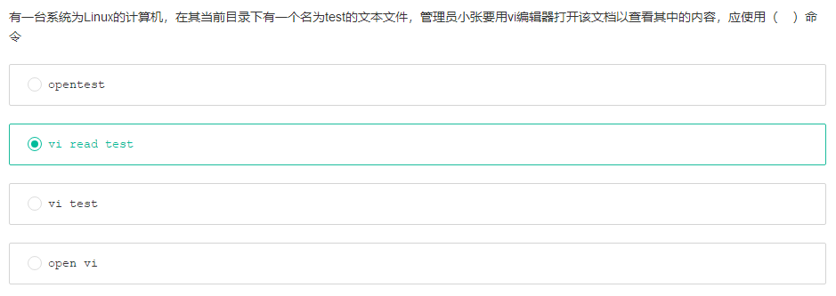

      懂vi/vim不用说

## 文件目录结构相关

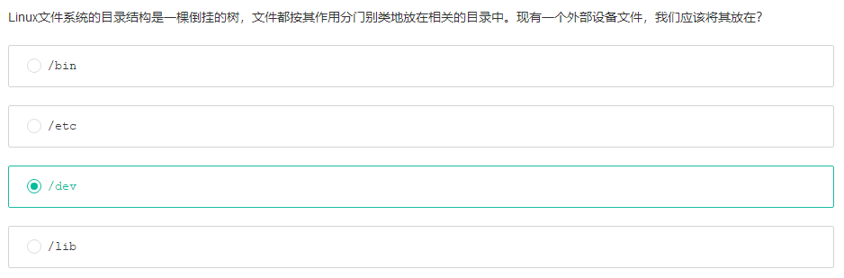

      /bin:一般存放所有用户都可执行的二进制
      /etc:存放系统配置，软件配置
      /lib:共享库，内核源码/lib/src

## 文件目录属性

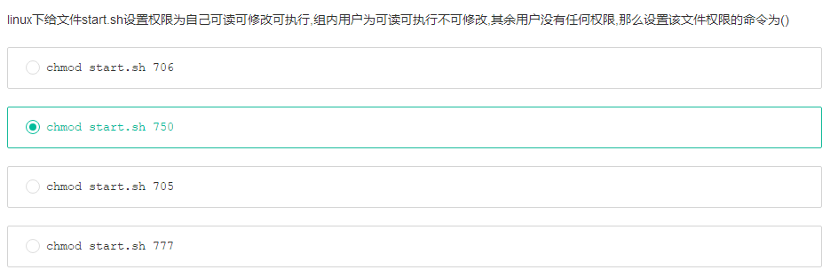

      只要看最后一句话就可以了

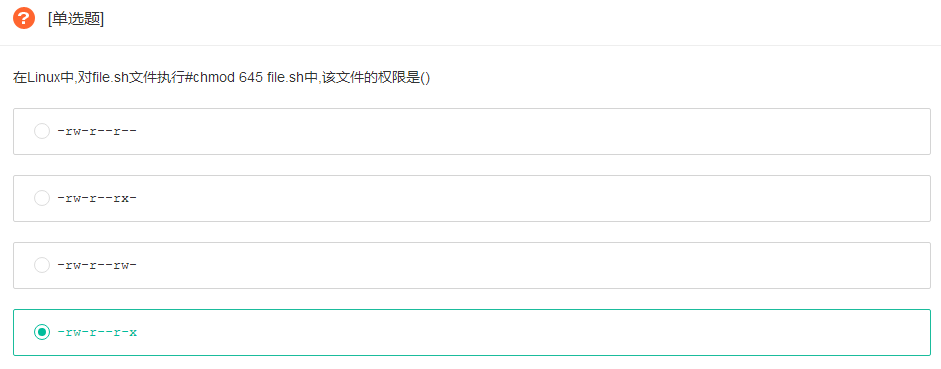

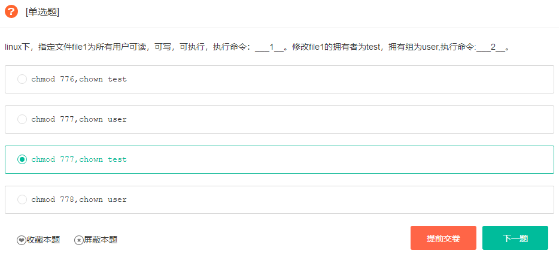

      chown test:user fileordirname

## 文件目录增删改查

      more只能用空格回车
      less可以用上下键查看

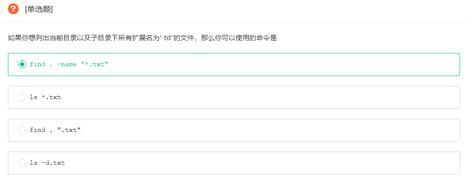

      注意，题干说到及其子目录

## 常用系统状态属性检索

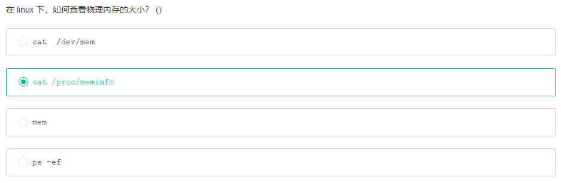

      /proc:伪文件系统

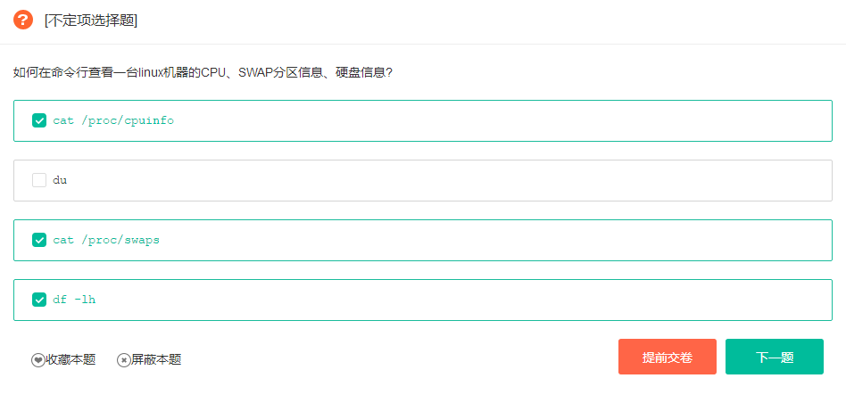

## 软/硬链接

## 用户态/内核态相关

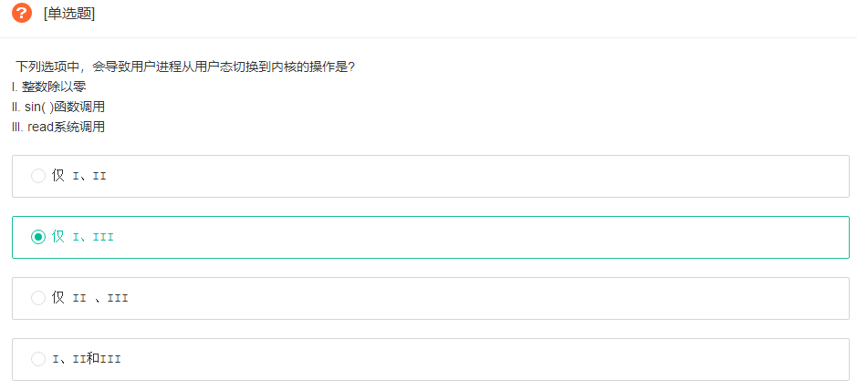

## 异常中断相关

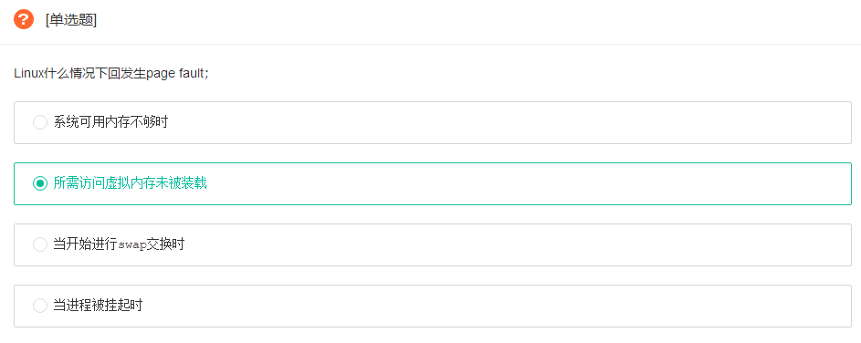

      swap分为换入换出

## 软件包管理相关

      Ubuntu/Debian 用的apt
      CentOS/Fedora 用的yum
      apt下可以装yum，反过来不行

## 压缩解压

      linux 常用压缩格式 .zip  .gz  .bz2    .tar.gz      .tar.bz2
      zip 压缩文件名 源文件 ——压缩文件
      zip -r 压缩文件名 源文件 ——压缩目录
      mkdir 名字——创建目录
      touch 名字 ——创建文件
      unzip 压缩文件 ——解压  .zip文件
      gzip 源文件 ——压缩为.gz格式的压缩文件，源文件会消失
      gzip -c 源文件 > 压缩文件 ——压缩为.gz格式的压缩文件，源文件会消失
      gzip -r 目录 ——压缩目录下的所有子文件，但不能压缩目录
      gzip -d 压缩文件 ——解压 .gz文件
      gunzip 压缩文件名 ——解压 .gz文件 
      bzip2 源文件 ——压缩为 .bz2格式，不保留源文件
      bzip2 -k 源文件 ——压缩后保留源文件
      注意bzip2 不能压缩目录
      bzip2 -d 压缩文件 ——解压缩，-k保留压缩文件
      bunzip2 压缩文件 ——解压缩
      tar -cvf 打包文件名 源文件
      tar -zcvf 压缩报名.tar.gz 源文件 ——压缩为.tar.gz格式
      tar -zxvf 压缩报名.tar.gz ——解压缩.tar.gz包
      tar -jcvf 压缩报名.tar.bz2 源文件 ——压缩为.tar.bz2格式
      tar -jxvf 压缩报名.tar.bz2 ——解压缩.tar.bz2包

      tar 打包，不压缩
      -x 解压缩
      -c 创建压缩
      -v 显示详细信息
      -f filename 后面接要被被处理的档案名或目标名
      tar -zcvf archiveName.tar.gz  filename1 dirname1 ...
      tar -zxvf archiveName.tar.gz

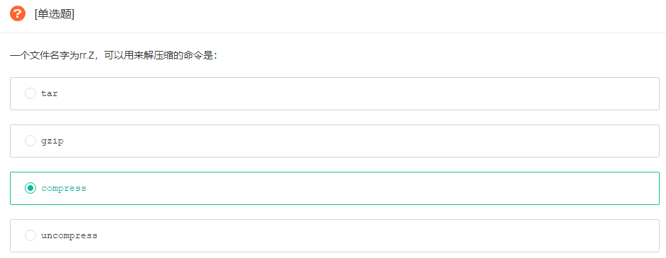

      compress 是一个相当古老的 unix 档案 压缩 指令，压缩后的档案会加上一个 .Z 延伸档名以区别未压缩的档案，压缩后的档案可以以 uncompress解压 。

## 系统服务

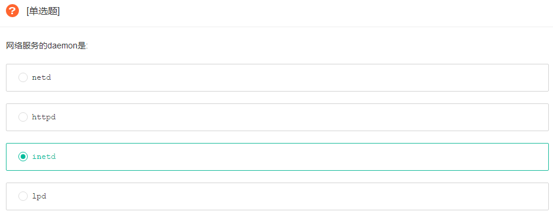

## shell脚本

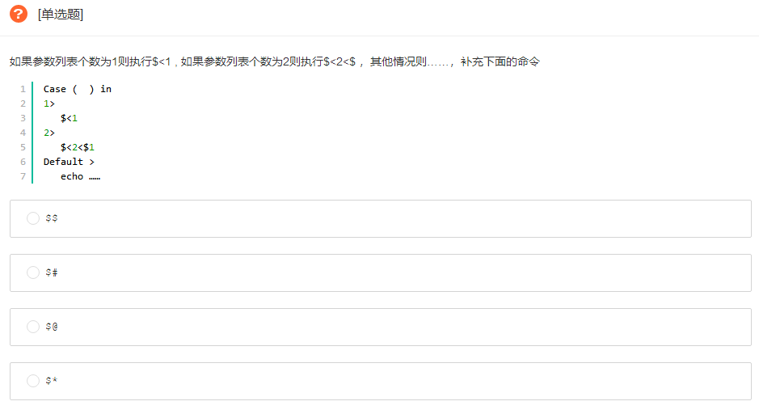

## 进程相关

      进程通信

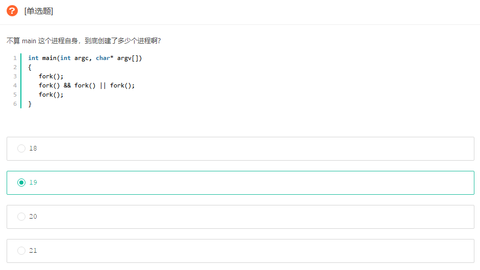

## X server/client相关

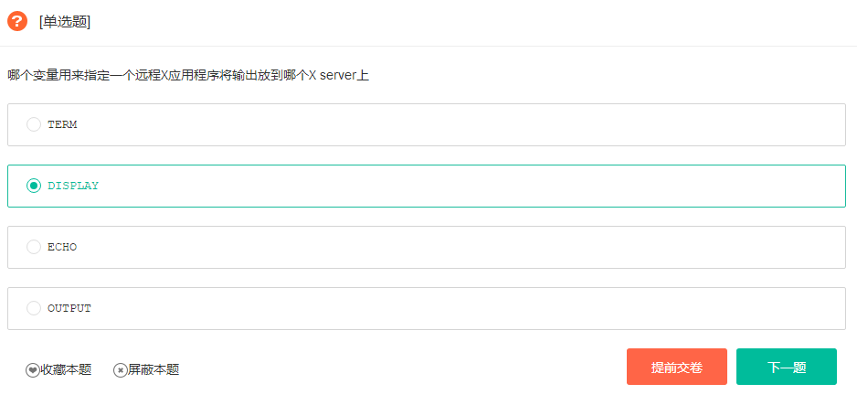

## 死锁

## Makefile

## TCP三次握手

## DHCP

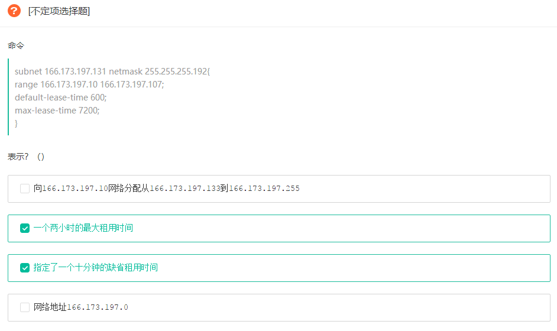

## VSFTP

## SAMBA

## NFS

## 系统安装

## 网络检索设定相关

## 环境变量配置

## 总结

      典型问题
        进程数计算
        文件目录属性
